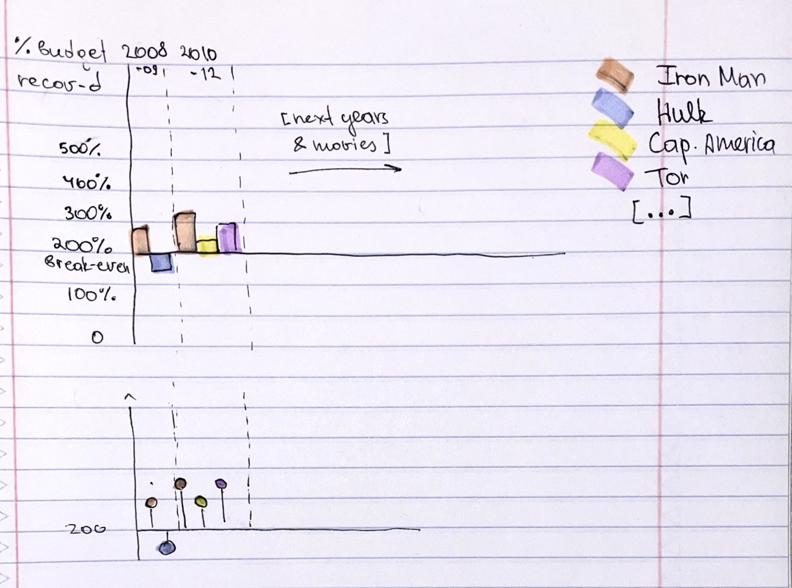
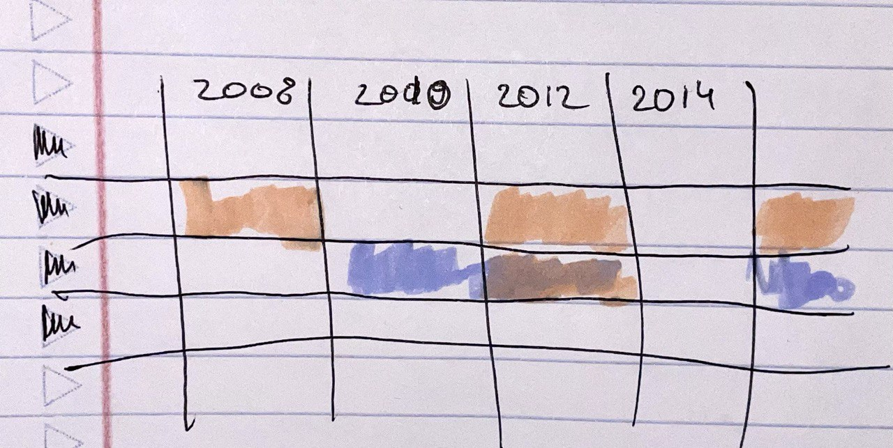

| [home page](https://cmustudent.github.io/tswd-portfolio-templates/) | [data viz examples](dataviz-examples) | [critique by design](critique-by-design) | [final project I](final-project-part-one) | [final project II](final-project-part-two) | [final project III](final-project-part-three) |

# Critique by Design Exercise
# Case: "Which is The Best Performing Marvel Movie?" Chart

_For each step below, you should document your progress as you move forward.  In terms of tone, think of the writeup as though you're keeping journal of your step-by-step process.   You should include a any insights you gained from the critique method, and what it led you to think about when considering the redesign.  You should talk about how you moved next to the sketches, and any insights you gleaned from your user feedback.  Document what you changed based on the user feedback in your redesign.  Finally, talk about what your redesigned data visualization shows, why you selected the data visualization you did, and what you attempted to show or do differently._

_You can include screenshots, sketches or other artifacts with your narrative to help tell the story of how you moved through the process.  Again, make sure to avoid including any personally identifying information about your interviewees (don't list full names, etc.).  While this template serves as a guide, make sure to reference the assignment writeup on Canvas for the official guidance.  This template does not include all guidance mentioned on the assignment page._

## Step one: the visualization

I chose the dataviz on the marvel movies' success: https://informationisbeautiful.net/visualizations/which-is-the-best-performing-marvel-movie/ 

It's the topic closest to my major and I liked the original visualisation (aesthetically and only in the beginning, ha-ha)

## Step two: the critique

The chart looks nice, **aesthetically** pleasing, engaging and exciting **_in the beginning_**, but once you actually start trying to make sense out of it, it’s terrible(ish). 

The authors’ notes about the various possible metrics of success are promising and create an illusion that you'll be explained how to use the vizualization, but in the end those notes are not practically helpful and also cover only a tiny bit of all the variety of data represented by the viz. Authors just throw you into this data pool without explaining how to swim in it. So, I’d say: 

- This visualization is **"over-complete"** – it’s too much information, so it becomes unclear what context to consider (average/breakeven lines are helpful as benchmarks but not ideal – see the comment on them below).
- The chart is not **intuitive**, even though it’s simple, because the justification to put some metrics into the x-axis and others into the y-axis is unclear. The intersection of the axes is not intuitive either: it’s supposed to refer either to 0 or some point of convergence, but none of the combinations follow this rule. The order of number of on the axes is also counterintuitive in relation to the logic of the metrics (e.g. 1st & 2nd weekend drop off is going down to the lowest negative %, but the negativity is already reflected in the name of the metric, so you expect the drop-off number to rise on the chart as something bad that escalates).
- The additional average / breakeven lines are also confusing being below the x axis (that's intuitively assoicated with 0).
- The chart is still somehow **useful**, though, if you’re ready to dig deeper and find meaning in some of the metrics’ combinations and/or if you’re from the industry and know from experience which connections make sense. I assume this chart's intended audience mighty be either someone who's seriously interested in the film industry and that business, or people who work in this sphere. However, even if you'er redy to poke around, it will take some serious mental effort to interpret the chart, so the **perceptibility** is not great either.
- At the same time, the chart is most probably truthful and, in a way, engaging – it’s entertaining to try to find a decent combination of metrics, and some of them can be insightful if you take a closer look.

## Step three: Sketch a solution

Target audience: I was keeping in mind film industry professionals – eaither the producing/managin team of Marvel franchise, or screen-play writers who work for Marvel francise or other similar film and want to study the performance patterns to further deeper analyse the movie properties that might lead to commercial success.

### Most of Marvel Movies Break Even. Som of Them Make Good Profit

For the initial sketch I decided to leave the default metrics from the original vizualisation – % of Budget Recovered for each film in francises and Year.

I changed the x-axis so it reflects the break-even point – 200%. It's higher than 100% because the movie budget doesn't include the markrting budget, so usually to break-even considering promotion ependitures a movie should earn at least twice as much as it's production budget. Putting the break-even point as x-axis will help to grasp immediately which movies generated profit and which didn't.

I also sketched bar charts to showcase levels and though of popsicles as an alternative option to make the chart less crowded (basically same scatterplot points, but grounded to the axis which might maeke it easier to track the overal picture)

I decided to leave year because thought that it might be interesting to see what movies perform better and when and compare it to the outter context from particular time (assuming that the audiemce is professional and familiar with such context)

## Step four: Test the solution

I had an interview with two MEIM studndt who I'll refer to as MEIM 1 and MEIM 2

**1. How do you think what this chart explains?**
Both got that it's about movies and their profitability, but asked why break-even was at 200% and not 100%. MEIM 1 suggestedt to clarify the title to make it clear but both liked the idea of setting the axis as a breakeve level.

**2. Does anything confuse you on this chart?** _(this question also implies the question "What would you do differently" because we just switch to a conversation with them giving feedback and ,e reacting and asking clarifying questions back)_

MEIM 1: Does the same color refer to the same movie? Why is it in two different years then? 
(I explained that colors refer to francises and the name of a particular film would go into pop-up window)

MEIM 1: I also don't really understand why do you need the year here. And how many films is this gonna be? It will be to crowded probably when you add all of them (I agreed but said the the year is needed).

MEIM 2: The year thng confuses me too. Can you put the in rows, as a y-axis maybe?

MEIM 1: Or leave years in columns but separate franhises by rows? Also, It's not clear if you compare francises between each other or movies withi francises. Right now it's all together, I think you should pick.

After several iterations within that part of the conversation this is what the option that a sketched (rows are movies and color was supposed to be gradient between opposite hues showing if the movie broke-even or not)

**3. What audience it could be for?**

MEIM 2: Students like us who study film? Or professionals from the industry, maybe those who invest in Marvel movies
   
### Synthesis: 

- I drafted a sketch, a vizualization structure that should be more easily digestable and better structured than what I sketched initially
- Thanks to the conversation I started thinking how to get read of the year variable as a key one or if it's significant in such for, at all
- I agreed with the comment on that it's better to figure out what comparison I want to showcase: between different frincises by some KPI or between films in the same francise over the years. I also started thinking how I can effectively show both.
- I decided to show % of budget recovered as a colour, instead of asigning colors to each movie / francise, and indicate movies in the rows instead.
  
## Step five: build the solution

For the final version, I decided not to use the version we discussed within interviews because I relased showing timeline doesn't really make sense in this case. I decided to concentrate on one of the relantionship examining wihch would potentially allow to dig deeper in the further research, since the data is not sufficient tom make any reliable inference. I focused on the relantionship between Opening Weekend Revenue and the % of Budget Recovered, hypothesising that the film that did well within the first show would gain momentum and would be more likely to break even faster and gan more profit. 

<noscript></noscript><object class='tableauViz'  style='display:none;'><param name='host_url' value='https%3A%2F%2Fpublic.tableau.com%2F' /> <param name='embed_code_version' value='3' /> <param name='site_root' value='' /><param name='name' value='MarvelMociesSuccess&#47;Sheet3' /><param name='tabs' value='no' /><param name='toolbar' value='yes' /><param name='static_image' value='https:&#47;&#47;public.tableau.com&#47;static&#47;images&#47;Ma&#47;MarvelMociesSuccess&#47;Sheet3&#47;1.png' /> <param name='animate_transition' value='yes' /><param name='display_static_image' value='yes' /><param name='display_spinner' value='yes' /><param name='display_overlay' value='yes' /><param name='display_count' value='yes' /><param name='language' value='en-US' /><param name='filter' value='publish=yes' /></object>
                

