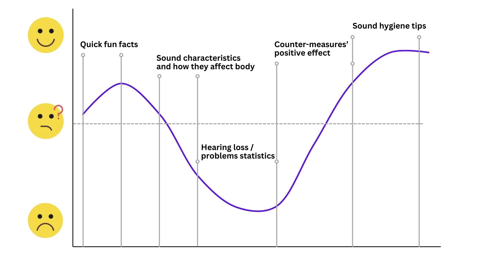
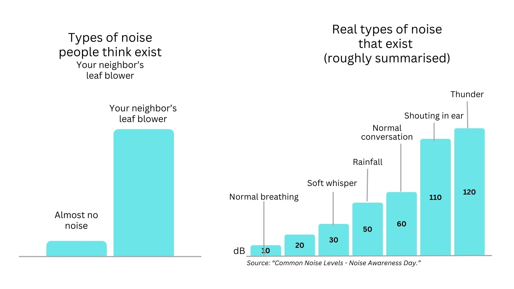

| [home page](https://cmustudent.github.io/tswd-portfolio-templates/) | [data viz examples](dataviz-examples) | [critique by design](critique-by-design) | [final project I](final-project-part-one) | [final project II](final-project-part-two) | [final project III](final-project-part-three) |

> Important note: this template includes major elements of Part I, but the instructions on Canvas are the authoritative source.  Make sure to read through the assignment page and review the rubric to confirm you have everything you need before submitting.  When done, delete these instructions before submitting.

# Outline
Sound is an essential part of the physical world we exist in, and its impact on our lives extends far beyound liking or disliking some sounds aesthetically. Sound can both heal and harm. There would be no sound without silence.

Nowadays, noise pollution created by humans is increasingly prevalent in most parts of the world. Long enough exposure to loud enough sounds, mostly technical noise, and particular frequencies can cause various kinds of mental, sleep, cardio-vascular and other illneses. Living in a world of pervasive technical noise requires a better attention to our sound hygiene to preserve our health and well-being.

Within my final project, I aim to show how exactly particular levels and kinds of sound (noise) may affect humans' wellbeing, and how we're all exposed to that kind of sounds much more often than we think we are. My intent is to encourage the audience use simple sound hygienen tips I will cover in my project as well.

## Story structure

1. Quick "fun facts" about our perception of sounds and their physical haracteristics (dB level / frequences) --> 
2. How those characteristics affects our body, illustrating where the hurting levels are and comparing them to familiar sonic experiences
3. Healthcare data on hearing loss for different occupations + age when hearing problems start (connected to the previous points through the noise levels)
4. (something positive) Data on the effectiveness of noise cancelling devices and/or exposure to natural sound (there's good noise out there!)
5. Tips on sound hygiene to avoid adverse sonic effects and reinforce positive ones

**One sentence summary:** We should pay more attention to our sound hygiene as it is directly afecting our erllbeing.

## User story

**As a modern-age human / big-city resident, I want** to know how my soundscape affects me and how I can manage it better, **so I can** enhance my wellbeing.

**I can do this by** developing healthy sound hygiene habits: reducing my exposure to adverse noise and increasing my exposure to restorative sounds.

## Story Arc

## Initial sketches

***

Chart 1: Certain ocupation leads to early hearing loss

Chart 2: We lose our hearing faster than our grand parents

# The data
> A couple of paragraphs that document your data source(s), and an explanation of how you plan on using your data. 

Text here...

> A link to the publicly-accessible datasets you plan on using, or a link to a copy of the data you've uploaded to your Github repository, Box account or other publicly-accessible location. Using a datasource that is already publicly accessible is highly encouraged.  If you anticipate using a data source other than something that would be publicly available please talk to me first. 

| Name | URL | Description |
|------|-----|-------------|
|      |     |             |
|      |     |             |
|      |     |             |

# Method and medium
> In a few sentences, you should document how you plan on completing your final project. 

Text here...

## References
_List any references you used here._

## AI acknowledgements
_If you used AI to help you complete this assignment (within the parameters of the instruction and course guidelines), detail your use of AI for this assignment here._
