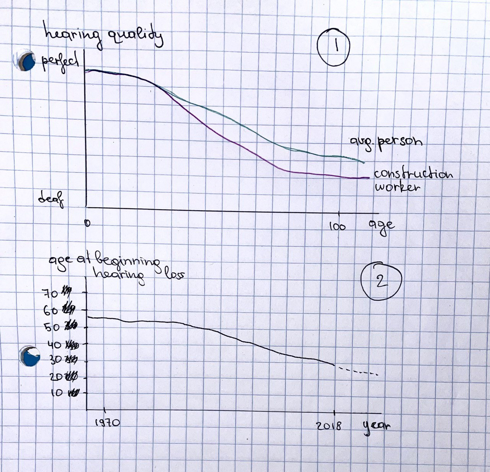

| [home page](https://sofiaakhman.github.io/Portfolio.-Sofia-Akhmanaeva/) | [data viz examples](dataviz-examples) | [critique by design](critique-by-design) | [final project I](final-project-part-one) | [final project II](final-project-part-two) | [final project III](final-project-part-three) |

# Outline
Sound is an essential part of the physical world we exist in, and its impact on our lives extends far beyound liking or disliking some sounds aesthetically. Sound can both heal and harm. There would be no sound without silence.

Nowadays, noise pollution created by humans is increasingly prevalent in most parts of the world. Long enough exposure to loud enough sounds, mostly technical noise, and particular frequencies can cause various kinds of mental, sleep, cardio-vascular and other illneses. Living in a world of pervasive technical noise requires a better attention to our sound hygiene to preserve our health and well-being.

Within my final project, I aim to show how exactly particular levels and kinds of sound (noise) may affect humans' wellbeing, and how we're all exposed to that kind of sounds much more often than we think we are. My intent is to encourage the audience use simple sound hygienen tips I will cover in my project as well.

## Story structure

1. Quick "fun facts" about our perception of sounds and their physical haracteristics (dB level / frequences) --> 
2. How those characteristics affects our body, illustrating where the hurting levels are and comparing them to familiar sonic experiences
3. Healthcare data on hearing loss for different occupations + age when hearing problems start (connected to the previous points through the noise levels)
4. (something positive) Data on the effectiveness of noise cancelling devices and/or exposure to natural sound (there's good noise out there!)
5. Tips on sound hygiene to avoid adverse sonic effects and reinforce positive ones

**One sentence summary:** We should pay more attention to our sound hygiene as it is directly afecting our erllbeing.

## User story

**As a modern-age human / big-city resident, I want** to know how my soundscape affects me and how I can manage it better, **so I can** enhance my wellbeing.

**I can do this by** developing healthy sound hygiene habits: reducing my exposure to adverse noise and increasing my exposure to restorative sounds.

## Story Arc

## Initial sketches

***

Chart 1: Certain ocupation leads to early hearing loss

Chart 2: We lose our hearing faster than our grand parents

# The data

Main data I'm going to use is from IPUMS Health surveys that contains  reach number of hearing related data and spans back to 1950s and till 2018. (https://nhis.ipums.org/nhis/sda.shtml ). I'm in process of figuring out how to extract it properly, but I alreeady defined a group of variables that I will work with. Line charts above use real variables that are present in the IPUMS record.

For bar charts above I used the International Noise Awareness Day website: https://noiseawareness.org/info-center/common-noise-levels/ 

I will also inform further work with the articles indicated below. I just reviewed most of them to help with brainstorming process and building the narrative. I will dive deeper into defining more precise connections between data pieces. Most of them are on (a) urban noise effect on wellbeing, (b) sound's impact on particular aspects of health (i.e. cardio-vascular deseases and stress levels) etc.

# Method and medium

- I will confirm the data source within the next 1.5 weeks, and will also find the plan B narrative that's easily adjustable, in the case IPUMS will not work out and I will not find an alternative dataset.
- After confirming the data source and the narrative, I will draft the list of relationship / cause-effect linkages I want to show and what ideas I want to illustrate with them.
- Then I will define the best type o graphs for those illustration
- And finally will polish my storytelling with definining how to present infographics so there is dynamic and clearly stated message.

## References

(see The Data section)

## AI acknowledgements
_If you used AI to help you complete this assignment (within the parameters of the instruction and course guidelines), detail your use of AI for this assignment here._
