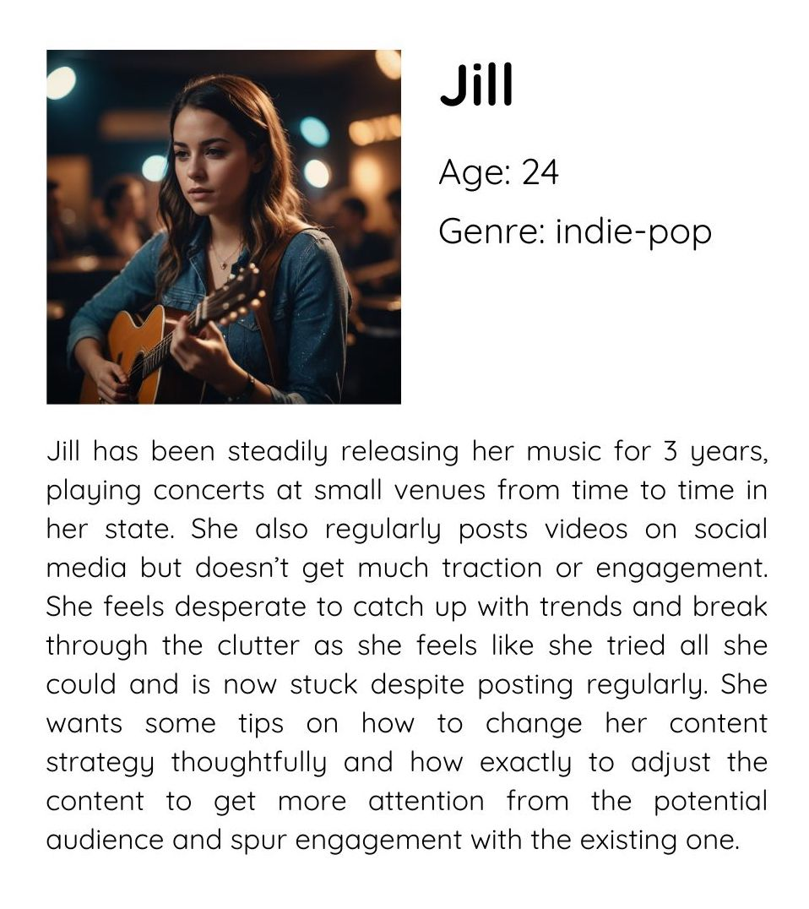

| [home page](https://cmustudent.github.io/tswd-portfolio-templates/) | [data viz examples](dataviz-examples) | [critique by design](critique-by-design) | [final project I](final-project-part-one) | [final project II](final-project-part-two) | [final project III](final-project-part-three) |

# The final data story
Shorthand sotry link: https://carnegiemellon.shorthandstories.com/socials-remix/index.html

# Changes made since Part II

1. I built up both parts of the of the story on Shorthand – why's and how's - and accomponied it with meaningful comments on both music related data and social media trends context in general as some of my critique interviewee advised. I also added a success story in the beginning as hook, which also came from one of the interview discussions between Part II and III with another MAM student.
2. I added the data that I planned to add after Part II: most popular short video formats (I found the data fo TikTok), genres popularity ranking among different ages, and social media channels popularity by age. All the charts will be embedded below with more detailed comments on the changes made for some of them, including design decisions.
3. I added the "helpful industry sources" section on shorthand that the target audience could use to explore the topic more and get more tips on the recommendations given in my guide. I also had to tweek every chart's dimensions, size and font size to make it readable on Shorthand. Charts' titles were edited too, to serve the narrative better.
4. I unified the colour palette, usig the same 4 colours for all the visualisations. Magenta and cyan(ish) shades were for the highlighted parts of the infographic or equal parts of it, lavender and light-blue – for the parts that had to be "grayed" out but still distinguishable.

## Charts & Comments

_Disclaimer: the dimensions of the charts might be a bit off on Github because they were made for Shorthand and appear bigger everywhere else._

***

<noscript></noscript><object class='tableauViz'  style='display:none;'><param name='host_url' value='https%3A%2F%2Fpublic.tableau.com%2F' /> <param name='embed_code_version' value='3' /> <param name='site_root' value='' /><param name='name' value='musicdiscoverychannels&#47;musicdiscovery' /><param name='tabs' value='no' /><param name='toolbar' value='yes' /><param name='static_image' value='https:&#47;&#47;public.tableau.com&#47;static&#47;images&#47;mu&#47;musicdiscoverychannels&#47;musicdiscovery&#47;1.png' /> <param name='animate_transition' value='yes' /><param name='display_static_image' value='yes' /><param name='display_spinner' value='yes' /><param name='display_overlay' value='yes' /><param name='display_count' value='yes' /><param name='language' value='en-US' /></object>
    

### Specific changes: 
I made cirles a bit transperant so the overlaping areas are still visible, deleted the legend and put annotation on the graph itself instead. Within one of the new critique sessions with a MAM student I adjusted annotations so they're less scattered through the chart and all based ont he first "column's" items. 

***

<noscript></noscript><object class='tableauViz'  style='display:none;'><param name='host_url' value='https%3A%2F%2Fpublic.tableau.com%2F' /> <param name='embed_code_version' value='3' /> <param name='site_root' value='' /><param name='name' value='tiktokpurchases&#47;tiktokpurchases' /><param name='tabs' value='no' /><param name='toolbar' value='yes' /><param name='static_image' value='https:&#47;&#47;public.tableau.com&#47;static&#47;images&#47;ti&#47;tiktokpurchases&#47;tiktokpurchases&#47;1.png' /> <param name='animate_transition' value='yes' /><param name='display_static_image' value='yes' /><param name='display_spinner' value='yes' /><param name='display_overlay' value='yes' /><param name='display_count' value='yes' /><param name='language' value='en-US' /></object>
       

### Specific changes: 
Per advice from a new MAM student interviewee, I separated existing data from the forecast data by graying the fater-2025 part of the chart; I also deleted the legend and put annotations instead.

***

<noscript></noscript><object class='tableauViz'  style='display:none;'><param name='host_url' value='https%3A%2F%2Fpublic.tableau.com%2F' /> <param name='embed_code_version' value='3' /> <param name='site_root' value='' /><param name='name' value='sentiments_17405430428370&#47;sentiments' /><param name='tabs' value='no' /><param name='toolbar' value='yes' /><param name='static_image' value='https:&#47;&#47;public.tableau.com&#47;static&#47;images&#47;se&#47;sentiments_17405430428370&#47;sentiments&#47;1.png' /> <param name='animate_transition' value='yes' /><param name='display_static_image' value='yes' /><param name='display_spinner' value='yes' /><param name='display_overlay' value='yes' /><param name='display_count' value='yes' /><param name='language' value='en-US' /></object>
       

***

<noscript></noscript><object class='tableauViz'  style='display:none;'><param name='host_url' value='https%3A%2F%2Fpublic.tableau.com%2F' /> <param name='embed_code_version' value='3' /> <param name='site_root' value='' /><param name='name' value='favgenres&#47;favgenres' /><param name='tabs' value='no' /><param name='toolbar' value='yes' /><param name='static_image' value='https:&#47;&#47;public.tableau.com&#47;static&#47;images&#47;fa&#47;favgenres&#47;favgenres&#47;1.png' /> <param name='animate_transition' value='yes' /><param name='display_static_image' value='yes' /><param name='display_spinner' value='yes' /><param name='display_overlay' value='yes' /><param name='display_count' value='yes' /><param name='language' value='en-US' /></object>
      

### Specific changes: 
This is a new graph added after Part II.

***

_Note: on Shorthand this graph is built within a Shorthand tables module instead of Tableau embeded code_

<noscript></noscript><object class='tableauViz'  style='display:none;'><param name='host_url' value='https%3A%2F%2Fpublic.tableau.com%2F' /> <param name='embed_code_version' value='3' /> <param name='site_root' value='' /><param name='name' value='socialsage&#47;Sheet6' /><param name='tabs' value='no' /><param name='toolbar' value='yes' /><param name='static_image' value='https:&#47;&#47;public.tableau.com&#47;static&#47;images&#47;so&#47;socialsage&#47;Sheet6&#47;1.png' /> <param name='animate_transition' value='yes' /><param name='display_static_image' value='yes' /><param name='display_spinner' value='yes' /><param name='display_overlay' value='yes' /><param name='display_count' value='yes' /><param name='language' value='en-US' /></object>
      

### Specific changes: 
This is a new graph added after Part II.

***

<noscript></noscript><object class='tableauViz'  style='display:none;'><param name='host_url' value='https%3A%2F%2Fpublic.tableau.com%2F' /> <param name='embed_code_version' value='3' /> <param name='site_root' value='' /><param name='name' value='correlations_17405438122760&#47;Sheet4' /><param name='tabs' value='no' /><param name='toolbar' value='yes' /><param name='static_image' value='https:&#47;&#47;public.tableau.com&#47;static&#47;images&#47;co&#47;correlations_17405438122760&#47;Sheet4&#47;1.png' /> <param name='animate_transition' value='yes' /><param name='display_static_image' value='yes' /><param name='display_spinner' value='yes' /><param name='display_overlay' value='yes' /><param name='display_count' value='yes' /><param name='language' value='en-US' /></object>
       

### Specific changes: 
I changed the colours and the order so the charts with stronger correlation go first. On Shorthand, I also added a definition of the valence as a note, following the interwiewee's recommendation.

***

## The audience

The guide built up on Shorthand is aimed at DYI developing musicians who are eaither new to social media or find themselves in a deadlock with managing their socials for success. They either don't know how to start or discouraged by unsuccessful atempts. These artists want more systemic view on how to manage their social media, what channels to prioritize and how to connect with their audience, as well as some reccommendations on sources to learn more. 
This story could be a short introductory guide for these artist to start creating content strategically, based on the understanding of their positioning and of their potential audience characteristics.

The core audience description did not change mushc since Part II. For more clearity I created two customer personas that represent the terget audience.
On shorthand, I also added more industry sources following a MAM interviewee advice as it might be highly relevant for the target audience.

### Persona 1

### Persona 2

## References
See Shorthand. No other references were added for this version.

## AI acknowledgements
I used an AI image geberator embeded into Canva to generate personas' portrait.

# Final thoughts
> You can summarize any final thoughts / reflections that don't fit well in the previous sections here.  How did it go?  What did you run out of time for, or wish you had a chance to revisit?  What were you most excited about?  Include any final reflections as you think they might help us understand your process.  If you already included such reflections elsewhere, you can delete this section. 

- Finding relevant data was a great struggle, I guess the best idea within the course would be to see what topic has a decent variety of data first, rather than just choose a preferable topic and stick to it. I guess it should take a separate time and attention to (a) develop several topics / stories options with ideas for each about what exact data is needed to transmit each message, and (b) to test all these ideas by checking if the needed data actually exist and it's in a proper condition.
- To my surprise, Tableau turned out to be easier than I expected. I know that we didn't really covered all its functionalities, but I felt excited about having this tool in my portifolio.
- Beyond the course, in general, I think I will apply this data-storytelling frame in many situatoins. I also feel like I would do this as a hobbie, for example, when I find some exciting data, ot literally want to tell a story, I can imagine myself building a similar presentation just as an educaional tool or jsut for fun.
- Datawraper and other tools we used are also exciting, although I didn't get very familiar with them, it would be nice to have more time for all of them.

